<h1 align="center">Predicting Quality of Portuguese Vinho</h1>


## **Objective:**
The objective of this project is to develop a predictive model that can accurately predict the quality of Portuguese Vinho wine based on its physicochemical properties.


## **Dataset Description:**
The dataset contains physicochemical attributes of red and white variants of Vinho, as well as their respective quality ratings. The attributes include fixed acidity, volatile acidity, citric acid, residual sugar, chlorides, free sulfur dioxide, total sulfur dioxide, density, pH, sulphates, alcohol content, and color (red or white). The quality ratings range from 3 to 9.


## **Features Description:**
|       Field Name       |           Description                 |
|------------------------|--------------------------------------------|
|    **fixed acidity**   | The amount of non-volatile acids in the wine, typically expressed in grams per liter (g/L). |
|   **volatile acidity** | The amount of acetic acid in the wine, which can lead to an unpleasant vinegar taste, typically expressed in g/L. |
|       **citric acid**  | The amount of citric acid in the wine, which can add freshness and flavor, typically expressed in g/L. |
|    **residual sugar**  | The amount of sugar remaining after fermentation stops, typically expressed in g/L. |
|        **chlorides**   | The amount of salt in the wine, typically expressed in g/L. |
| **free sulfur dioxide**| The amount of free sulfur dioxide in the wine, which prevents microbial growth and oxidation, typically expressed in parts per million (ppm). |
|**total sulfur dioxide**| The total amount of sulfur dioxide in the wine, including both free and bound forms, typically expressed in ppm. |
|        **density**     | The density of the wine, typically expressed in grams per milliliter (g/mL). |
|           **pH**       | The acidity or basicity of the wine, measured on a scale from 0 to 14. |
|      **sulphates**     | The amount of sulfates in the wine, which can act as an antioxidant or preservative, typically expressed in g/L. |
|        **alcohol**     | The percentage of alcohol content in the wine by volume. |
|        **quality**     | The subjective quality rating of the wine, usually ranging from 1 to 10. |
|          **color**     | The color of the wine, indicating whether it is red or white. |


## **Data Preparation:**
### **1. Import necessary libraries like pandas, numpy, and sklearn for data manipulation and modeling.**
```
import pandas as pd
import numpy as np
import matplotlib.pyplot as plt
import seaborn as sns
from sklearn.metrics import classification_report, confusion_matrix
from sklearn.tree import DecisionTreeClassifier
from sklearn.ensemble import RandomForestClassifier
from sklearn.model_selection import train_test_split
from sklearn.metrics import accuracy_score
from imblearn.over_sampling import SMOTE
import warnings
warnings.filterwarnings('ignore')
from sklearn.neighbors import KNeighborsClassifier
from sklearn.model_selection import train_test_split
from sklearn.metrics import accuracy_score,precision_score,recall_score
```

### **2. Load the red and white wine datasets using pd.read_csv.**
```
red_wine = pd.read_csv("winequality_red.csv", delimiter=";")
red_wine
```

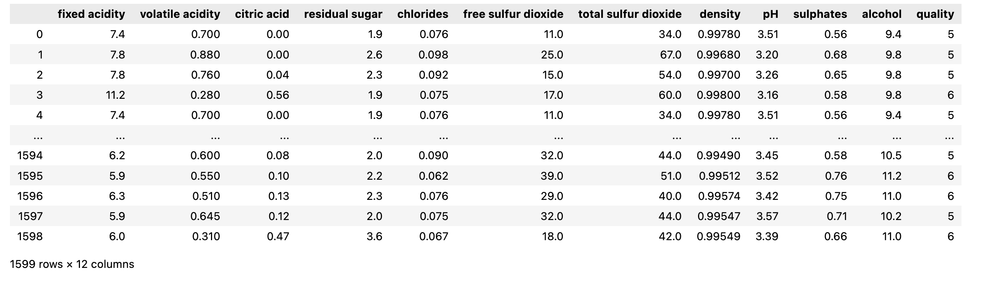

### **3. Merge the datasets based on common columns.**
```
red_wine['color'] = ['Red']* red_wine.shape[0]
white_wine['color'] = ['White']* white_wine.shape[0]
dataset = red_wine.merge(white_wine,how='outer')
dataset
```

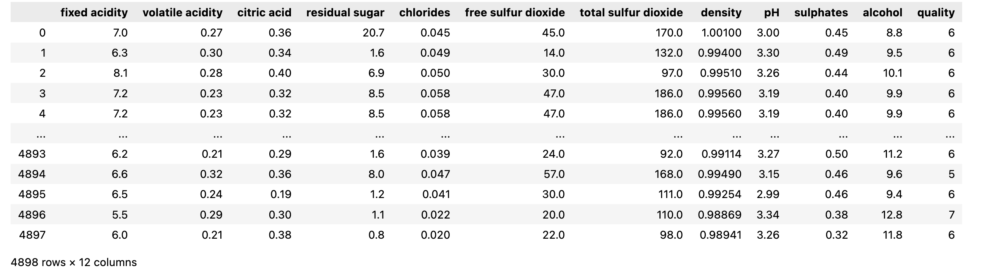

### **4. Reserve 50 random observations for testing and remove them from the main dataset.**
```
indicies = np.random.randint(1,dataset.shape[0],50)
testing = dataset.iloc[indicies]
data = dataset.drop(indicies,axis=0)
```

### **5. Check basic information about the dataset using info() and describe() methods.**
```
data.info()
```


```
data.describe()
```

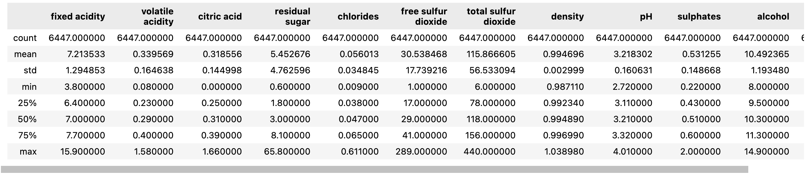

### **6. Explore the Features** 
```
for column in data.columns:
    print('Feature: ',column)
    print('Data type:',data[column].dtype)
    print( "Unique values : ", data[column].nunique())
    print()
```

```
Feature:  fixed acidity
Data type: float64
Unique values :  106

Feature:  volatile acidity
Data type: float64
Unique values :  187

Feature:  citric acid
Data type: float64
Unique values :  89

Feature:  residual sugar
Data type: float64
Unique values :  316

Feature:  chlorides
Data type: float64
Unique values :  214

Feature:  free sulfur dioxide
Data type: float64
Unique values :  134

Feature:  total sulfur dioxide
Data type: float64
Unique values :  275

Feature:  density
Data type: float64
Unique values :  995

Feature:  pH
Data type: float64
Unique values :  108

Feature:  sulphates
Data type: float64
Unique values :  111

Feature:  alcohol
Data type: float64
Unique values :  113

Feature:  quality
Data type: int64
Unique values :  7

Feature:  color
Data type: object
Unique values :  2
```
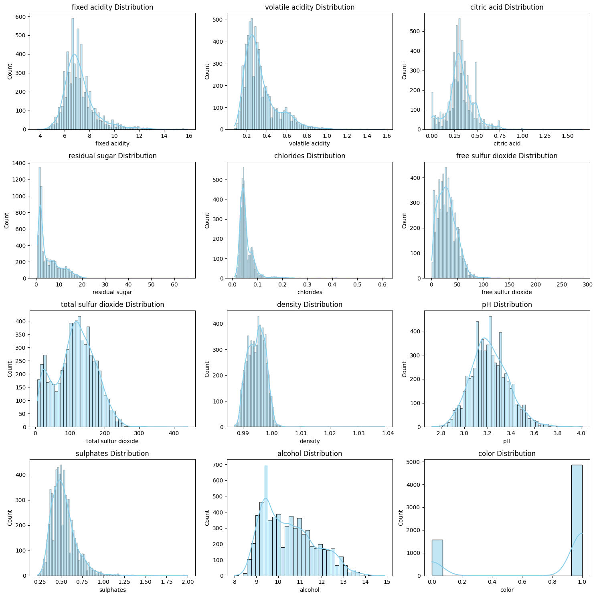

## **Exploratory data analysis (EDA)**
### **1. Convert the 'color' column to numeric values ('Red' as 0 and 'White' as 1) for classification.**
```
data['color'] = data['color'].map({'Red':0,'White':1})
```

### **2. Conduct feature selection to identify the most relevant attributes for predicting wine quality.**
```
import matplotlib.pyplot as plt
import seaborn as sns

fig, axes = plt.subplots(nrows=4, ncols=3, figsize=(15, 15))

axes = axes.flatten()

for i, column in enumerate(data.drop(columns=['quality']).columns):  
    sns.histplot(data=data, x=column, ax=axes[i], kde=True, color='skyblue')
    axes[i].set_title(f"{column} Distribution")

plt.tight_layout()
plt.show()
```

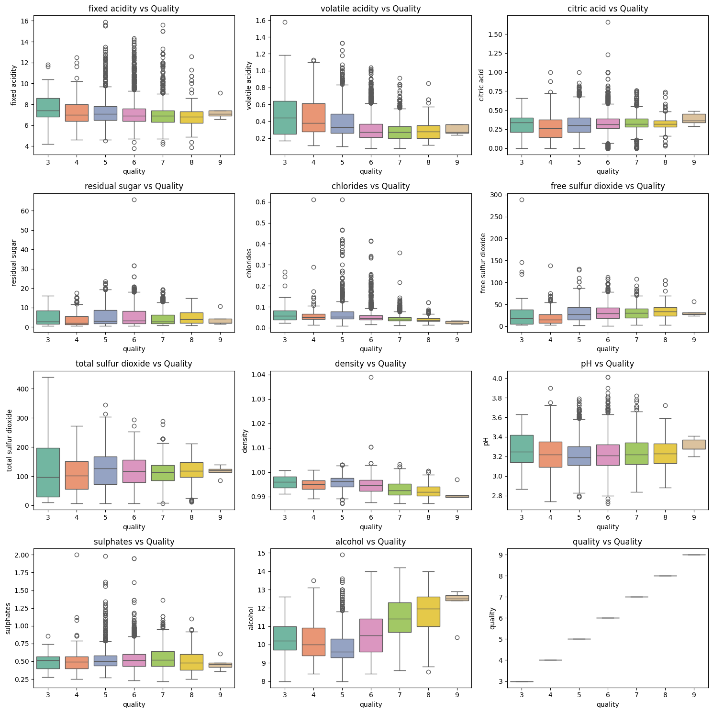 

### **3. Explore relationships between features and quality ratings.**
```
import matplotlib.pyplot as plt
import seaborn as sns

fig, axes = plt.subplots(nrows=4, ncols=3, figsize=(15, 15))
axes = axes.flatten()
for i, column in enumerate(data.columns[:-1]): 
    sns.boxplot(data=data, x='quality', y=column, ax=axes[i], palette='Set2')
    axes[i].set_title(f"{column} vs Quality")
plt.tight_layout()
plt.show()
```

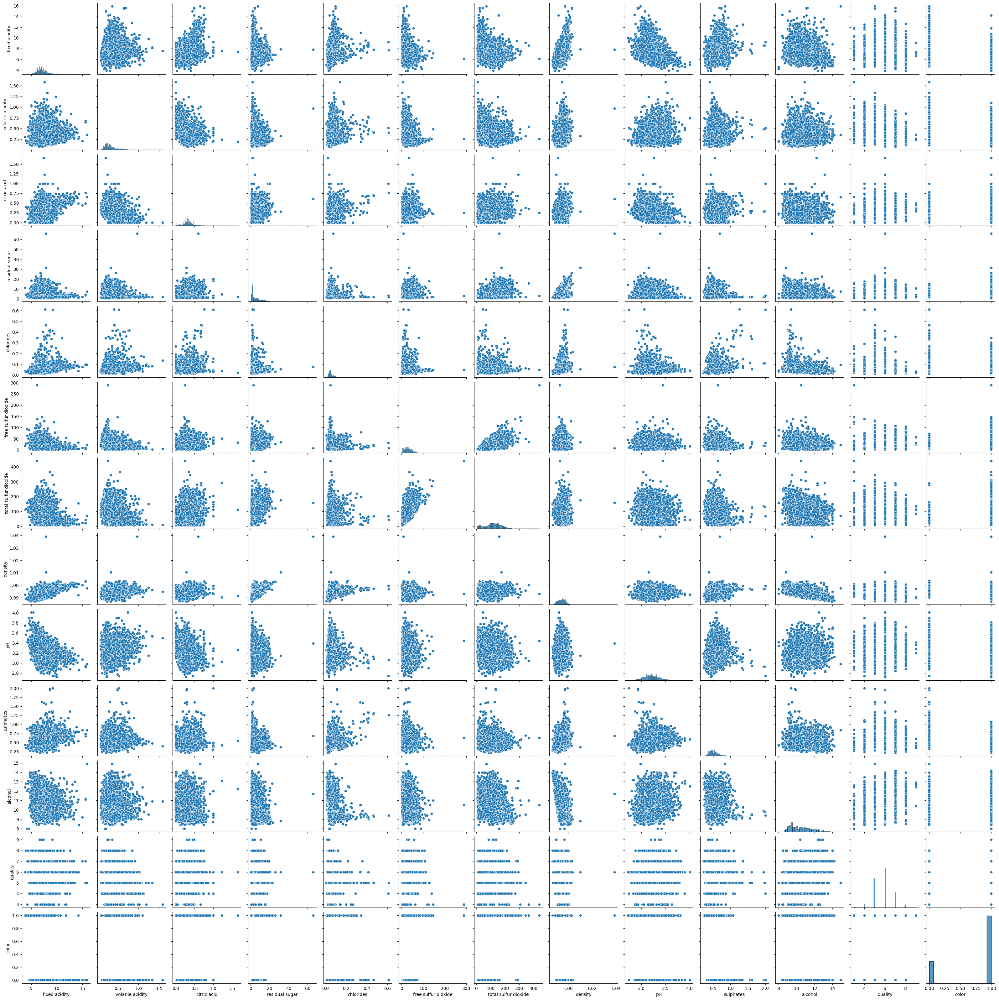

### **4. Engineer new features if necessary to capture additional information that may influence wine quality.**
```
sns.pairplot(data)
plt.show()
```

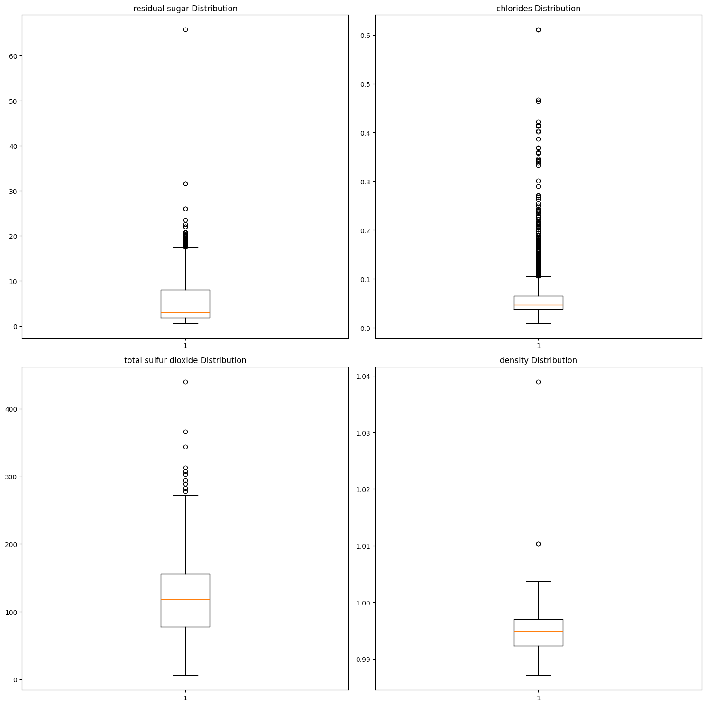

## **Data Preprocessing:**
### **1. Assess the presence of missing data**
```
data.isnull().sum()
```

```
fixed acidity           0
volatile acidity        0
citric acid             0
residual sugar          0
chlorides               0
free sulfur dioxide     0
total sulfur dioxide    0
density                 0
pH                      0
sulphates               0
alcohol                 0
quality                 0
color                   0
dtype: int64
```

### **2. Assess the presence of outliers**
```
fig, axes = plt.subplots(nrows=2, ncols=2, figsize=(15, 15))
axes = axes.flatten()
subplot_index = 0
continous_features = []
for column in data.drop(columns=['quality']).columns:
    if data[column].nunique() > 200:
        continous_features.append(column)
        axes[subplot_index].boxplot(data[column])
        axes[subplot_index].set_title(f"{column} Distribution")
        subplot_index += 1
        if subplot_index % 4 == 0:
            subplot_index += 1 
for ax in axes[subplot_index:]:
    ax.axis('off')
plt.tight_layout()
plt.show()
```

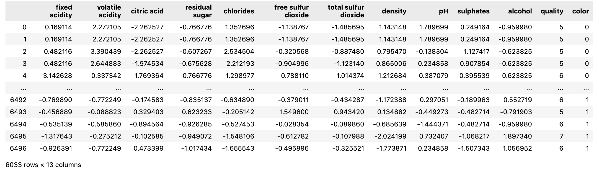

### **3. Remove outliers based on the upper bound of the interquartile range.**
```
def outlier_upper_limit(data, column):
    Q1 = data[column].quantile(0.25)
    Q3 = data[column].quantile(0.75)
    IQR = Q3 - Q1
    upper_bound = Q3 + 1.5 * IQR
    return upper_bound

rows = data.shape[0]
for column in continous_features:
    outlier_indicies =  data[data[column]> outlier_upper_limit(data,column)].index
    data = data.drop(outlier_indicies,axis=0)
print('Number of observations dropped: ',rows - data.shape[0])
```

```
Number of observations dropped:  414
```

### **4. Scaling**
**Scale features using StandardScaler.**
```
from sklearn.preprocessing import StandardScaler
scaler = StandardScaler()
for column in data.drop(columns=['quality','color']).columns:
    data[column] = scaler.fit_transform(data[[column]])
```
```
data
```

### **5. Handle multicollinearity by dropping less correlated features ('color' and 'density').**
```
plt.figure(figsize=(10,8))
sns.heatmap(data.drop(columns=['quality']).corr(),annot=True)
plt.show()
```

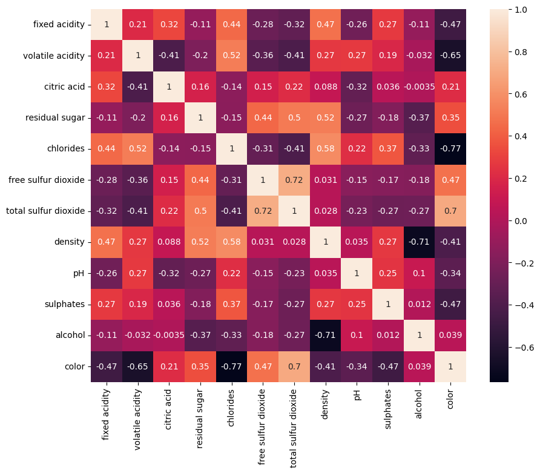

```
These features are correlated (correlation value > 0.65 or < -0.65)
    volatile acidity ~ color
    chlorides ~ color
    density ~ alcohol
```

```
sns.heatmap(data.corr()[['quality']],annot=True)
plt.show()
```

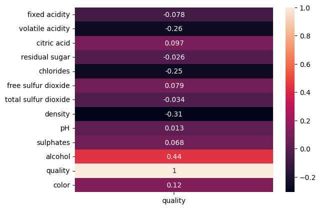

**After comparing all the features with the target variable, 'color' & 'density' are less correlated with the target variable. So we are removing these features.**

```
data.drop(columns=['color','density'],inplace=True)
```
## **Feature Selection & Engineering:**
### **1.Unveiling Imbalance Data.**
```
print(data['quality'].value_counts())
data['quality'].value_counts().plot(kind= 'bar')
plt.show()
```

```
quality
6    2656
5    1910
7    1047
4     204
8     190
3      21
9       5
Name: count, dtype: int64
```

 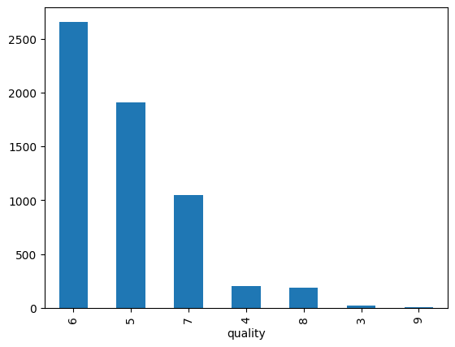


### **2. Balance the dataset using SMOTE (Synthetic Minority Over-sampling Technique) and random undersampling.**
```
from imblearn.over_sampling import SMOTE
from imblearn.under_sampling import RandomUnderSampler
from imblearn.pipeline import Pipeline
from collections import Counter

X = data.drop(columns=['quality'])
y = data['quality']
print("Class distribution before resampling:", Counter(y))

pipeline = Pipeline([
    ('over', SMOTE(sampling_strategy='auto', k_neighbors=3)),  
    ('under', RandomUnderSampler(sampling_strategy='auto')) 
])

X_resampled, y_resampled = pipeline.fit_resample(X, y)
print("Class distribution after resampling:", Counter(y_resampled))
```

```
Class distribution before resampling: Counter({6: 2656, 5: 1910, 7: 1047, 4: 204, 8: 190, 3: 21, 9: 5})
Class distribution after resampling: Counter({3: 2656, 4: 2656, 5: 2656, 6: 2656, 7: 2656, 8: 2656, 9: 2656})
```

### **3. Use RandomForestClassifier, Selected top features based on importance scores.**
```
rf = RandomForestClassifier()
rf.fit(X_resampled,y_resampled)
vals = rf.feature_importances_
for i in range(len(X_resampled.columns)):
    print(X_resampled.columns[i],'-',round(vals[i],4))
```

```
fixed acidity - 0.1022
volatile acidity - 0.107
citric acid - 0.0914
residual sugar - 0.0767
chlorides - 0.1152
free sulfur dioxide - 0.0974
total sulfur dioxide - 0.0863
pH - 0.0955
sulphates - 0.0854
alcohol - 0.143

Based on the feature importance, these are the order of features 
['alcohol','chlorides','volatile acidity','fixed acidity','free sulfur dioxide','pH','citric acid','sulphates','total sulfur dioxide','residual sugar']
```  
### **Model Building and Evaluation:**
  1. Initialized classifiers including Decision Tree, Random Forest, and K-Nearest Neighbors.
  2. Split the dataset into training and testing sets.
  3. Fitted the models on the training data and evaluated their performance using accuracy, precision, and recall on both training and testing sets.
```
dt = DecisionTreeClassifier()
rf = RandomForestClassifier()
knn = KNeighborsClassifier()
models = [dt, rf, knn]
X_train, X_test, y_train, y_test = train_test_split(X_resampled, y_resampled, test_size=0.3, random_state=42)
for model in models:
    model.fit(X_train, y_train)
    y_pred_train = model.predict(X_train)
    train_accuracy = accuracy_score(y_train, y_pred_train)
    y_pred_test = model.predict(X_test)
    test_accuracy = accuracy_score(y_test, y_pred_test)
    test_precision = precision_score(y_test, y_pred_test, average='weighted')
    test_recall = recall_score(y_test, y_pred_test, average='weighted')
    
    print(f"Model: {type(model).__name__}")
    print(f"Train Accuracy: {round(train_accuracy, 3)}")
    print(f"Test Accuracy: {round(test_accuracy, 3)}")
    print(f"Precision: {round(test_precision, 3)}")
    print(f"Recall: {round(test_recall, 3)}")
    print("------------------------------------")
```

```
Model: DecisionTreeClassifier
Train Accuracy: 1.0
Test Accuracy: 0.83
Precision: 0.826
Recall: 0.83
------------------------------------
Model: RandomForestClassifier
Train Accuracy: 1.0
Test Accuracy: 0.898
Precision: 0.895
Recall: 0.898
------------------------------------
Model: KNeighborsClassifier
Train Accuracy: 0.89
Test Accuracy: 0.831
Precision: 0.818
Recall: 0.831
------------------------------------
```
***All of these models, Random Forest gave the best metric values**

## **Hyperparameter Tuning:**
1. Conduct hyperparameter tuning for the Random Forest model using GridSearchCV.
2. Define parameter grids to search over.
3. Find the best combination of parameters and corresponding score. 

```
from sklearn.model_selection import GridSearchCV
param_grid = {
    'n_estimators': [100, 200, 300],
    'max_depth': [10, 20],   
    'min_samples_split': [2, 5, 10],    }
rf = RandomForestClassifier(random_state=42)
grid_search = GridSearchCV(estimator=rf, param_grid=param_grid, cv=5, scoring='accuracy', n_jobs=-1)
grid_search.fit(X_train, y_train)
best_params = grid_search.best_params_
best_score = grid_search.best_score_
print("Best Parameters:", best_params)
print("Best Score:", best_score)
```

```
Best Parameters: {'max_depth': 20, 'min_samples_split': 2, 'n_estimators': 300}
Best Score: 0.8881969984966792
```

## **Final Model Evaluation:**
1. Evaluate the tuned Random Forest model on the test set.
2. Calculate accuracy, precision, recall, and generated a classification report and confusion matrix.

```
rf = RandomForestClassifier(max_depth = 20,min_samples_split= 2, n_estimators =300)
X_train, X_test, y_train, y_test = train_test_split(X_resampled, y_resampled, test_size=0.3, random_state=42)
rf.fit(X_train, y_train)
y_pred_train = rf.predict(X_train)
train_accuracy = accuracy_score(y_train, y_pred_train)
y_pred_test = rf.predict(X_test)
test_accuracy = accuracy_score(y_test, y_pred_test)
test_precision = precision_score(y_test, y_pred_test, average='weighted')
test_recall = recall_score(y_test, y_pred_test, average='weighted')
print(f"Train Accuracy: {round(train_accuracy, 3)}")
print(f"Test Accuracy: {round(test_accuracy, 3)}")
print(f"Precision: {round(test_precision, 3)}")
print(f"Recall: {round(test_recall, 3)}")
print("Classification Report:")
print(classification_report(y_test, y_pred_test))
print("Confusion Matrix:")
print(confusion_matrix(y_test, y_pred_test))
```

```
Train Accuracy: 1.0
Test Accuracy: 0.897
Precision: 0.894
Recall: 0.897
Classification Report:
              precision    recall  f1-score   support

           3       0.99      1.00      1.00       791
           4       0.92      0.98      0.95       781
           5       0.82      0.78      0.80       819
           6       0.72      0.66      0.69       803
           7       0.84      0.87      0.86       792
           8       0.97      0.98      0.97       796
           9       1.00      1.00      1.00       796

    accuracy                           0.90      5578
   macro avg       0.89      0.90      0.90      5578
weighted avg       0.89      0.90      0.89      5578

Confusion Matrix:
[[791   0   0   0   0   0   0]
 [  0 767   9   4   1   0   0]
 [  1  35 642 128  12   1   0]
 [  4  25 120 533 105  15   1]
 [  1   3  12  72 692  12   0]
 [  0   0   0   4  10 781   1]
 [  0   0   0   0   0   0 796]]
```

## **Testing on New Data:**
1. Scale the reserved 50 observations for testing using the same scaler applied to the training data.
2. Apply the trained model to the scaled test data and evaluated its performance using accuracy, precision, recall, a classification report, and a confusion matrix.
```
from sklearn.preprocessing import StandardScaler
scaler = StandardScaler()
testing = testing[data.columns]
for column in testing.drop(columns=['quality']).columns:
    testing[column] = scaler.fit_transform(testing[[column]])
    
X = testing.drop(columns=['quality'])
y = testing['quality']
y_test_pred= rf.predict(X)
accuracy = accuracy_score(y, y_test_pred)
precision = precision_score(y, y_test_pred, average='weighted')
recall = recall_score(y, y_test_pred, average='weighted')
print(f"Accuracy score: {round(accuracy, 3)}")
print(f"Precision: {round(precision, 3)}")
print(f"Recall: {round(recall, 3)}")
print()
print("Confusion Matrix:")
print(confusion_matrix(y, y_test_pred))
print()
print("Classification Report:")
print(classification_report(y, y_test_pred))
```

```
Accuracy score: 0.48
Precision: 0.544
Recall: 0.48

Confusion Matrix:
[[ 0  1  0  0  0  0]
 [ 0  0  1  0  0  0]
 [ 0  5  4  4  0  0]
 [ 0  1  3 17  5  1]
 [ 0  0  0  4  3  0]
 [ 0  0  0  0  1  0]]

Classification Report:
              precision    recall  f1-score   support

           3       0.00      0.00      0.00         1
           4       0.00      0.00      0.00         1
           5       0.50      0.31      0.38        13
           6       0.68      0.63      0.65        27
           7       0.33      0.43      0.38         7
           8       0.00      0.00      0.00         1

    accuracy                           0.48        50
   macro avg       0.25      0.23      0.23        50
weighted avg       0.54      0.48      0.50        50

```

